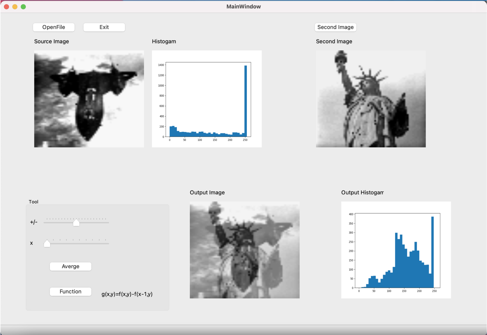

## Introduction
以 python 與 qt 作為使用介面，實行影像處理相關基本運作

- **Homework 1**
將 .64 檔案以 list 方式讀入，並將其 Ascii code 數字轉為 0~32 的數值，後再轉為0~255區間 有序的 32 個數字構成的 [64 ,64] np array，以灰階照片顯示。
直方圖以 matplotlib 繪製，存成png檔後再以彩色照片讀入 ui 的 qlabel 呈現。

- **Homework 2**
讀入相片檔（ BMP or JPEG ），並透過兩種不同灰階轉換方式進行 RGBtoGRAY ，同時將灰階後的相片進行線性內差產出放大與縮效後的樣子，最後更改影像亮度與對比度。
